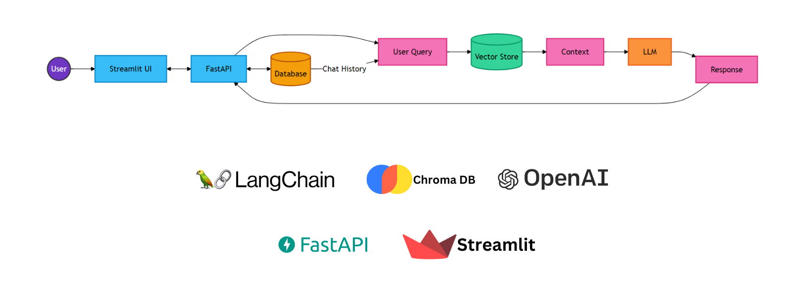
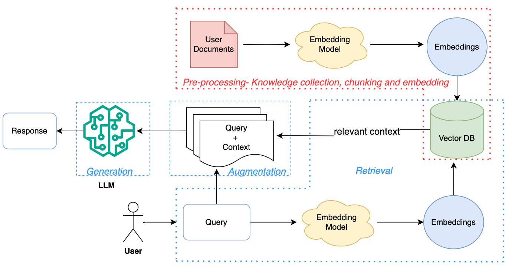

# RAG-Stream: A Local Retrieval-Augmented Generation Application

  
  
---

## Table of Contents

1. [Project Overview](#project-overview)  
2. [Key Features](#key-features)  
3. [Architecture & Workflow](#architecture--workflow)  
4. [Prerequisites](#prerequisites)  
5. [Installation](#installation)  
6. [Usage](#usage)  
7. [Project Structure](#project-structure)  
8. [Extending & Customization](#extending--customization)  
9. [Troubleshooting](#troubleshooting)  

---

## Project Overview

**RAG-Stream** is a local, end‑to‑end Retrieval‑Augmented Generation (RAG) application built with Streamlit and a FastAPI backend.Users can upload documents (PDF, TXT, CSV), which are ingested into a ChromaDB vector store.When interacting via chat, an LLM refines ambiguous queries using context from the last three turns, retrieves relevant document passages, and generates a coherent response.

---

## Key Features

- **Multi‑format Uploads**  
  - PDF, plain text, and CSV ingestion.  
  - Automatic text extraction and cleanup.

- **Local Vector Store**  
  - ChromaDB for on‑disk embedding storage.  
  - Fast nearest‑neighbour search.

- **Conversational Query Refinement**  
  - LLM rewrites or clarifies under‑specified queries using the previous three messages as context.  
  - Ensures more accurate retrieval.

- **Retrieval & Generation**  
  - Retrieves top‑k relevant chunks from ChromaDB.  
  - Feeds retrieved context + user query into LLM for final answer.

- **Streamlit Front End**  
  - Intuitive chat interface.  
  - Real‑time message update and history display.

- **FastAPI Backend**
   - RESTful API to handle ingestion, retrieval, and refinement requests.
   - Separate api/ folder contains all FastAPI routes and logic.

---

## Architecture & Workflow

1. **Upload & Ingestion**  
   - The user uploads documents via Streamlit’s file uploader.  
   - Backend extracts text (using libraries like `pdfplumber` or `pandas`), splits into chunks, and computes embeddings.

2. **Storage**  
   - Embeddings and metadata are stored in ChromaDB on the local filesystem.

3. **Query Handling**  
   - **Refinement:** If a user’s query is ambiguous, an LLM uses the last three chat turns to rephrase/clarify it.  
   - **Retrieval:** The refined query is converted to an embedding; ChromaDB returns nearest neighbors.  

4. **Generation**  
   - Concatenate retrieved chunks + refined query.  
   - Invoke LLM (e.g., OpenAI GPT or a local model) to generate the final response.

5. **Display**  
   - Streamlit displays the conversation history, including raw and refined queries, retrieved context snippets, and the model’s answer.

---

## Prerequisites

- Python 3.8 or higher  
- `pip` or `conda` package manager  
- Internet access for LLM API (optional if using a local model)

---

## Installation

1. **Clone the repository**  
   ```bash
   git clone https://github.com/lakhotiaharsh/rag-stream.git
   cd rag-stream

2. **Create & activate virtual environment**
    ```bash
    python -m venv .venv
    source .venv/bin/activate      # macOS/Linux
    .\.venv\Scripts\activate       # Windows

3. **Install dependencies**
    ```bash
    pip install -r requirements.txt

## Usage

1. **Start the server**
   ```bash
   cd api
   fastapi run main.py

2. **Start the Streamlit app**
    ```bash
    cd ../app
    streamlit run streamlit_app.py

3. **In your browser, go to http://localhost:8501 or follow the path provided in terminal**

4. **Upload documents (PDF/TXT)**

5. **Chat with the system:**

    - Type your question in the input box.
    - The app refines, retrieves, and generates an answer.
    - Scroll to view full conversation history.

## Project Structure
- Here is the project structure:
    ```pgsql
    rag-stream/
      ├── api/                      # FastAPI backend code
      │   ├── main.py               # API entrypoint and route definitions
      │   ├── chroma_utils.py       # Document ingestion & embedding logic
      │   ├── db_utils.py           # Uploading and storing in database
      │   ├── langchain_utils.py    # For llm processing
      │   ├── pydantic_models.py    # Structured input and output
      ├── app/                      # Streamlit front-end application
      │   ├── app_utils.py          # Streamlit UI & chat interface
      │   ├── chat_interface.py     # Streamlit UI & chat interface
      │   ├── sidebar.py            # Streamlit UI & chat interface
      │   ├── streamlit_app.py      # Streamlit UI & chat interface
      ├── llm_pipeline.png          # Architecture diagram for RAG pipeline
      ├── image.png                 # Architecture diagram for RAG pipeline
      ├── requirement.txt 
      ├── .env
      └── README.md                 # You are here


## Extending & Customization

- New File Types: Implement additional loaders in ingestion.py.
- Different Vector Store: Swap ChromaDB for FAISS or Milvus by updating ingestion.py.
- UI Enhancements: Use Streamlit components (e.g., st.chat_message) for richer messages.

## Troubleshooting

- No embeddings found: Ensure documents have been ingested. Check chroma/ directory.
